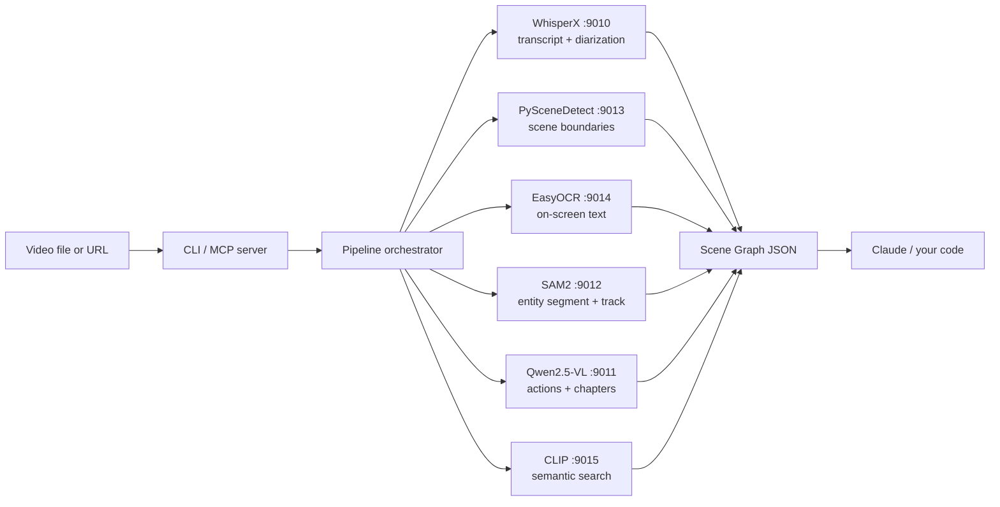

<p align="center">
  
</p>

<h1 align="center">VZT Video-Intel</h1>

<p align="center">
  <strong>The missing middle between raw video and reasoning models.</strong><br>
  Turn video into structured intelligence. <em>Citable. Queryable. AI-ready.</em><br>
  Self-hosted, 10× cheaper than Gemini native video.
</p>

<p align="center">
  <a href="LICENSE"></a>
  
  
  
  
  
  
</p>

---

## The gap

Claude Opus 4.7 is the best reasoning model in production. **It also cannot watch a video.** No native ingest. No audio. No frames. Not in May 2026.

Every existing "give Claude video" workaround sits at one of two poles:

- **Closed-box native models** — Gemini 3.1, Twelve Labs Pegasus, GPT-5.5 video. You hand them a clip; they hand you opaque inference. You can't audit, can't cite frames, can't self-host. And at scale they cost $2–4 / hour of video.
- **Primitive wrappers** — yt-dlp + Whisper + ffmpeg. You get a transcript. That's it. No scene graph. No entity tracking. No moment search. No timestamps Claude can cite.

VZT Video-Intel is the missing middle: a **self-hosted pipeline** that produces a **temporal scene graph** — structured JSON every element of which Claude can quote by timestamp — at roughly **$0.30 / GPU-hour**. **One install. CLI and MCP server. Same engine.**

---

## What you actually get

Hand `vzt-video-intel analyze ./your-clip.mp4` any video and back comes:

```jsonc
{
  "source": "./your-clip.mp4",
  "duration_ms": 124800,
  "scenes": [
    { "id": 0, "start_ms": 0,    "end_ms": 4200,  "shot_type": "wide" },
    { "id": 1, "start_ms": 4200, "end_ms": 9800,  "shot_type": "medium" }
  ],
  "transcript": [
    { "speaker": "SPEAKER_00", "start_ms": 120,  "end_ms": 2800, "text": "Welcome back to the show.", "confidence": 0.94 },
    { "speaker": "SPEAKER_01", "start_ms": 3100, "end_ms": 5400, "text": "Today we're breaking down...",  "confidence": 0.91 }
  ],
  "entities": [
    {
      "tracking_id": "p1",
      "label": "person",
      "confidence": 0.93,
      "appearances": [
        { "scene_id": 0, "start_ms": 0,    "end_ms": 4200, "bboxes": [{ "t_ms": 2100, "bbox": [120, 88, 412, 720] }] },
        { "scene_id": 1, "start_ms": 4200, "end_ms": 9800, "bboxes": [{ "t_ms": 6500, "bbox": [200, 100, 380, 700] }] }
      ]
    }
  ],
  "actions":  [{ "scene_id": 1, "start_ms": 5400, "end_ms": 7200, "label": "pointing at chart", "confidence": 0.87 }],
  "ocr":      [{ "start_ms": 0, "end_ms": 4200, "text": "LIVE • Q3 EARNINGS", "bbox": [40, 20, 320, 60] }],
  "keyframes":[{ "scene_id": 0, "t_ms": 2100, "jpeg_b64": "..." }],
  "_pipeline": "whisperx+scenedetect+easyocr+sam2+qwen-vl+clip",
  "_generated_at": "2026-05-13T22:14:08.901Z"
}
```

Now Claude can say:
> *"At 5.4s — second scene — the speaker points at a chart (action confidence 0.87) and says 'today we're breaking down...'. The same speaker (tracked as p1 across both scenes) was on a wide shot for the first 4.2 seconds."*

…instead of:
> *"The video appears to show some kind of presentation."*

That's the whole product.

---

## Just give me a video

You don't need Docker. You don't need a GPU. You need Node 20+. The CLI auto-detects what's available and picks the best execution path. Three modes ship out of the box:

### 🌩 Cloud mode — works in 60 seconds anywhere

```bash
npm install -g vzt-video-intel
vintel login                            # paste a Replicate token (https://replicate.com/account/api-tokens)
vintel analyze https://example.com/clip.mp4
```

Every heavy backend runs on Replicate. ~$0.06/min of video. Zero local infra. Works on a fresh MacBook, a Codespace, a Lambda.

### 🪶 Lite mode — free, offline, zero install

```bash
npm install -g vzt-video-intel
vintel analyze ./demo.mp4               # first run prompts you to pick a mode; pick lite
```

Whisper.cpp + ffmpeg + Tesseract + CLIP-ONNX, all pure-Node WASM. No Docker, no GPU, no API key. Heavy backends (Qwen-VL, SAM2) skip gracefully — you still get transcript, scenes, OCR, and CLIP search. Slower than cloud (~5× real-time on CPU), but free and runs on a plane.

### 🛠 Local mode — 10× cheaper at scale

```bash
git clone https://github.com/vonzelle-vzt/vzt-video-intel.git
cd vzt-video-intel && npm install && npm run build
vintel up                               # boots all 6 backends via docker-compose (needs Docker + GPU)
vintel analyze ./demo.mp4
```

Full self-hosted GPU stack. The power-user mode — boots WhisperX, Qwen2.5-VL, SAM2, PySceneDetect, EasyOCR, CLIP as FastAPI services. About **$0.30 / GPU-hour** vs cloud's $3.50, so it pays for itself the first month at any non-trivial volume.

### Auto — let it pick

```bash
vintel auto                             # prints recommended mode + per-stage routing
vintel auto --apply                     # persists the recommendation
```

`vintel auto` checks for an NVIDIA GPU, Docker daemon, ffmpeg, a Replicate token, and reachable local backends, then picks the best mode automatically. First-run wizard runs the same flow interactively the first time you call `vintel analyze`.

The output schema is **identical** across all three modes — only the execution path changes. Scene graphs you produced in lite mode are byte-for-byte compatible with cloud-mode scene graphs (minus the entities/actions arrays when those stages are skipped).

---

## The cost math (vs Gemini 3.1 native video)

| Provider | Pricing model | 1 hour of video | 100 hours | 1,000 hours |
|---|---|---|---|---|
| **Gemini 3.1 native video** (input tokens) | ~$0.0003 / token, ~13 tok / sec of video | **~$2.80** | ~$280 | ~$2,800 |
| **Twelve Labs Pegasus** | flat per-clip + indexing | ~$3.50 | ~$350 | ~$3,500 |
| **VZT Video-Intel** (own GPU) | $0.30 / GPU-hr (RTX 4090 spot) | **~$0.30** | ~$30 | **~$300** |
| **VZT Video-Intel** (rented A100) | $1.50 / GPU-hr | ~$1.50 | ~$150 | ~$1,500 |

At 1,000 hours of video — what an enterprise sports / media / surveillance team easily burns through monthly — **VZT Video-Intel pays for its own hardware in the first month**. Numbers verified May 2026 against published model pricing.

---

## Architecture

Six open-source models behind a single CLI. Each is a separate FastAPI service in the docker-compose stack, called via `POST /run` with a JSON body. Same HTTP contract across all six.



**Stage 1** (parallel): scenes + transcript + OCR — fully independent, fire concurrently.
**Stage 2** (per-scene, parallel): entity tracking + action recognition + keyframe extraction.
**Stage 3** (on demand): CLIP semantic search ("find me the moment when X happens").

Long-form videos can run incrementally — see [docs/ARCHITECTURE.md](docs/ARCHITECTURE.md).

---

## CLI reference

```
vzt-video-intel <command> [options]    # or `vintel` as a shorter alias

  analyze <source>             full pipeline → scene graph JSON
  transcribe <source>          WhisperX + diarization
  scenes <source>              scene boundaries (PySceneDetect)
  entities <source>            SAM2 entity tracking
  keyframes <source>           per-scene keyframes (base64 JPEG)
  ocr <source>                 on-screen text (EasyOCR)
  search <source> <query>      CLIP semantic moment search
  chapters <source>            Qwen2.5-VL chapter generation

  auto [--apply]               detect environment + recommend the best mode
  config [show|set k=v]        show or edit persisted config
  login [token]                store a Replicate API token
  doctor                       health-check local Docker backends
  up [--profile cpu|gpu]       boot the docker stack (local mode)
  down                         stop the docker stack
  init [--mcp-config]          first-run wizard
  mcp                          run as MCP stdio server (for Claude Code, Cursor, OpenCode)
```

All commands accept `--help` for full option lists.

### Examples

```bash
# Full pipeline, skip the expensive entity tracking and action recognition
vintel analyze ./game.mp4 --no-entities --no-actions

# Transcribe only, Spanish hint
vintel transcribe ./meeting.m4a --language=es

# Find the moment the ball crosses the line
vintel search ./highlight.mp4 "ball crossing the goal line" --top-k=5

# YouTube-style chapters
vintel chapters ./lecture.mp4 --style=course --count=12

# Pipe straight to jq
vintel transcribe ./call.mp3 | jq '.segments[] | select(.speaker == "SPEAKER_01")'
```

---

## Using it from Claude Code (MCP)

Add to `~/.claude.json` or your project's `.mcp.json`:

```json
{
  "mcpServers": {
    "vzt-video-intel": {
      "command": "npx",
      "args": ["vzt-video-intel", "mcp"]
    }
  }
}
```

Claude Code restarts the MCP server and exposes all 8 tools:

| Tool | What it does |
|---|---|
| `analyze_video` | Full pipeline; returns the complete scene graph |
| `extract_transcript` | WhisperX transcription with diarization |
| `detect_scenes` | PySceneDetect content-aware scene boundaries |
| `track_entities` | SAM2 segmentation + temporal tracking |
| `extract_keyframes` | Representative frames per scene (base64 JPEG) |
| `ocr_overlay` | EasyOCR text regions with timestamps |
| `semantic_search` | CLIP moment search by natural language |
| `generate_chapters` | LLM-driven chapter generation |
| `doctor` | Self-diagnostic — pings all 6 backends |

Then in Claude Code: *"Analyze ./game.mp4 and tell me what happens at the 2-minute mark."* Claude calls `analyze_video`, gets the scene graph, and cites timestamps.

See [docs/INTEGRATIONS.md](docs/INTEGRATIONS.md) for Cursor, OpenCode, Factory Droid, and raw `curl` recipes.

---

## Using it from your own code

```ts
import { analyzeVideo } from "vzt-video-intel/pipeline/orchestrator";

const graph = await analyzeVideo({
  source: "./highlight.mp4",
  includeKeyframes: true,
  trackEntities: true,
});

for (const action of graph.actions) {
  console.log(`${action.label} at ${action.start_ms}ms`);
}
```

Per-backend clients are also exported — see `src/backends/*` and [docs/SCHEMA.md](docs/SCHEMA.md).

---

## Five things that make this different

1. **Claude-native output schema.** Every element timestamped with `start_ms`/`end_ms`. Every entity has a stable `tracking_id` that survives across scenes. Every OCR region carries a bounding box. Claude can cite by timestamp instead of hallucinating about content.
2. **Six open-source backends, no closed boxes.** WhisperX, Qwen2.5-VL, SAM2, PySceneDetect, EasyOCR, CLIP. All inspectable. All swappable — see [docs/BACKENDS.md](docs/BACKENDS.md) to drop in Whisper.cpp or BLIP-2 instead.
3. **10× cheaper at scale.** Self-hosted GPU economics beat the closed video APIs by a factor of ten at any non-trivial volume.
4. **CLI + MCP duality.** Same engine ships as a shell-friendly CLI **and** as an MCP server for AI IDEs. One install, both modes. The CLI also has `up` / `down` / `doctor` / `init` — managing infrastructure isn't a separate skill.
5. **Plug-and-play.** Six docker images. One compose file. `up` then `doctor` then `analyze`. The README and CLI errors all point you to the next command — there are no hidden setup steps.

---

## Project layout

```
vzt-video-intel/
├── bin/                       CLI entry script
├── src/
│   ├── index.ts               MCP server (8 tools)
│   ├── cli.ts                 CLI dispatcher (commander)
│   ├── backends/              one HTTP client per backend
│   ├── pipeline/orchestrator  full pipeline coordinator
│   ├── schema/types.ts        SceneGraph TypeScript types
│   └── lib/                   env, http, mux, verify-backends
├── docker/
│   ├── docker-compose.yml     6-backend stack
│   ├── whisperx/              + Dockerfile + server.py
│   ├── qwen-vl/               + Dockerfile + server.py (vLLM)
│   ├── sam2/                  + Dockerfile + server.py
│   ├── scenedetect/           + Dockerfile + server.py
│   ├── easyocr/               + Dockerfile + server.py
│   └── clip/                  + Dockerfile + server.py
├── docs/
│   ├── ARCHITECTURE.md
│   ├── SCHEMA.md
│   ├── BACKENDS.md
│   ├── INTEGRATIONS.md
│   └── COMPARISON.md
├── examples/                  basic, transcribe-only, semantic-search, sports, meeting
├── test/smoke.test.ts
├── .github/workflows/ci.yml
└── LICENSE                    MIT
```

---

## Documentation

- **[ARCHITECTURE](docs/ARCHITECTURE.md)** — pipeline diagram, why these six models, data flow per stage
- **[SCHEMA](docs/SCHEMA.md)** — every field of the scene graph, with examples
- **[BACKENDS](docs/BACKENDS.md)** — per-backend HTTP contract, alternative models you can swap in
- **[INTEGRATIONS](docs/INTEGRATIONS.md)** — Claude Code, Cursor, OpenCode, Factory Droid, raw curl
- **[COMPARISON](docs/COMPARISON.md)** — side-by-side vs Gemini, Pegasus, GPT-5.5 video, OSS wrappers
- **[ROADMAP](ROADMAP.md)** — incremental processing, action fine-tuning, multi-camera sync
- **[CONTRIBUTING](CONTRIBUTING.md)** — setup, conventions, adding a new backend

---

## FAQ

**Do I need a GPU?**
You need one GPU for Qwen2.5-VL, SAM2, and CLIP. WhisperX runs on CPU but ~5× slower. EasyOCR and PySceneDetect are CPU-only. A single RTX 4090 (24 GB) is enough for Qwen2.5-VL-7B; the 72B model wants 2× A100.

**How long does a 10-minute video take?**
Real-time-ish on a 4090 (~10–12 min). Faster if you `--no-entities --no-actions`. SAM2 + Qwen action recognition are the two expensive stages.

**Can I run just one backend?**
Yes. Each backend is independent. Use `vintel transcribe ./x.mp4` and you only need WhisperX up.

**What about long videos?**
Stream a video in chunks; the schema supports stitching across chunks via stable scene IDs. See [docs/ARCHITECTURE.md#long-form-strategies](docs/ARCHITECTURE.md).

**Why FastAPI servers? Why not direct Python calls?**
HTTP isolation. Each model has different CUDA versions, Python deps, model weights. Putting them behind HTTP lets you upgrade one without breaking the others, run them on different machines, swap implementations.

**Is this a wrapper around Gemini / GPT-5.5?**
No. There's no closed-box API call anywhere in this stack. Everything runs on your hardware on open-source weights.

---

## License

MIT © 2026 VZT Tech Consulting. See [LICENSE](LICENSE).
