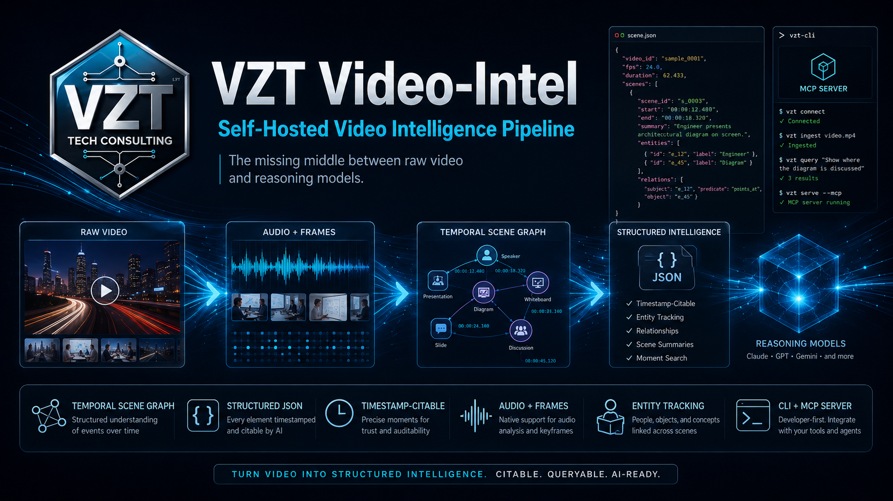
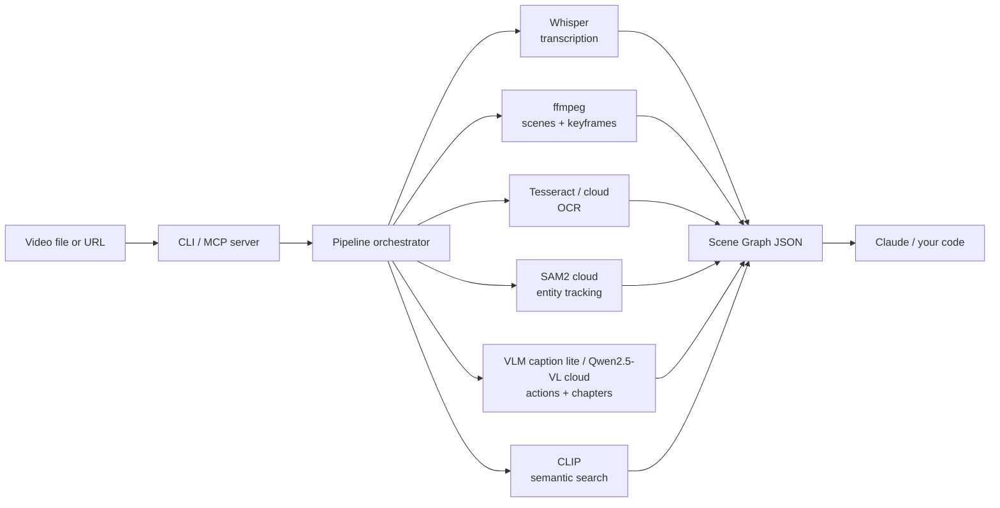

<p align="center">
  
</p>

<h1 align="center">VZT Video-Intel</h1>

<p align="center">
  <strong>The missing middle between raw video and reasoning models.</strong><br>
  Turn video into structured intelligence. <em>Citable. Queryable. AI-ready.</em><br>
  No Docker. No GPU. No Python.
</p>

<p align="center">
  <a href="LICENSE"></a>
  
  
  
  
  
  
</p>

---

## The gap

Reasoning models are getting eyes — slowly. But "can watch a video" is not the same as "has the video indexed." Even when a model ingests video natively, that ingest is **stateless and per-call**: you re-send the whole clip for every question, you get back opaque inference, and you can't cite a frame. It's the same reason you still embed and index documents even though models can read text.

Every "give Claude video" workaround sits at one of two poles:

- **Closed-box native models** — Gemini 3.1, Twelve Labs Pegasus, GPT-5.5 video. Hand them a clip, get opaque inference. You can't audit it, can't cite frames, and you pay again every time you ask.
- **Primitive wrappers** — yt-dlp + Whisper + ffmpeg. You get a transcript. That's it. No scene graph, no entity tracking, no moment search, no timestamps to cite.

VZT Video-Intel is the missing middle — and the middle is a **persistent index layer**, not a temporary gap-filler. It produces a **temporal scene graph**: structured JSON, every element citable by timestamp, written to a local store. **Analyze once, query forever** — re-analyzing a video is an instant cache read, and every `observe` / `search` / `chapters` call reuses it for free. One install. CLI and MCP server. Runs anywhere, no Docker.

---

## What you actually get

Hand `vintel analyze ./your-clip.mp4` any video and back comes:

```jsonc
{
  "source": "./your-clip.mp4",
  "duration_ms": 124800,
  "scenes": [
    { "id": 0, "start_ms": 0,    "end_ms": 4200,  "shot_type": "wide" },
    { "id": 1, "start_ms": 4200, "end_ms": 9800,  "shot_type": "medium" }
  ],
  "transcript": [
    { "start_ms": 120,  "end_ms": 2800, "text": "Welcome back to the show." },
    { "start_ms": 3100, "end_ms": 5400, "text": "Today we're breaking down..." }
  ],
  "entities": [
    {
      "tracking_id": "p1",
      "label": "person",
      "confidence": 0.93,
      "appearances": [
        { "scene_id": 0, "start_ms": 0,    "end_ms": 4200, "bboxes": [{ "t_ms": 2100, "bbox": [120, 88, 412, 720] }] },
        { "scene_id": 1, "start_ms": 4200, "end_ms": 9800, "bboxes": [{ "t_ms": 6500, "bbox": [200, 100, 380, 700] }] }
      ]
    }
  ],
  "actions":   [{ "scene_id": 1, "start_ms": 5400, "end_ms": 7200, "label": "pointing at chart", "confidence": 0.87 }],
  "ocr":       [{ "start_ms": 0, "end_ms": 4200, "text": "LIVE • Q3 EARNINGS", "bbox": [40, 20, 320, 60] }],
  "keyframes": [{ "scene_id": 0, "t_ms": 2100, "jpeg_b64": "..." }],
  "_version":  "1.4.0",
  "_generated_at": "2026-05-14T22:14:08.901Z"
}
```

Now Claude can say:
> *"At 5.4s — second scene — the speaker points at a chart (action confidence 0.87) and says 'today we're breaking down...'. The same speaker (tracked as p1 across both scenes) was on a wide shot for the first 4.2 seconds."*

…instead of:
> *"The video appears to show some kind of presentation."*

That's the whole product.

---

## Just give me a video

You need **Node 20+**. That's it.

```bash
npm install -g vzt-video-intel
vintel analyze ./demo.mp4               # first run prompts you to pick a mode
```

The CLI auto-detects what's available and picks the best execution path. Two modes ship out of the box:

### 🪶 Lite mode — free, offline, zero API key

```bash
npm install -g vzt-video-intel
vintel analyze ./demo.mp4
```

Pure-Node WASM pipeline. **Verified working on a fresh Windows machine with no GPU, no API key:**

| Stage | Backend | Verified |
|---|---|---|
| Transcript | `@xenova/transformers` Whisper-tiny (ONNX) | 4.6s for a 12s clip |
| Scenes | `ffmpeg-static` content-aware filter | < 1s |
| OCR | `tesseract.js` (WASM) | 93% confidence, accurate bboxes |
| Keyframes | `ffmpeg-static` | < 1s |
| Semantic search | `@xenova/transformers` CLIP ViT-B/32 (ONNX) | ~7s for a 12s clip |

Heavy backends (Qwen-VL action recognition, SAM2 entity tracking) skip gracefully in lite mode — set a Replicate token to enable them. No native compilation. No Python. Runs on macOS / Linux / Windows identically.

### 🌩 Cloud mode — full pipeline, ~$0.06/min

```bash
npm install -g vzt-video-intel
vintel login                            # paste a Replicate token (https://replicate.com/account/api-tokens)
vintel analyze https://example.com/clip.mp4
```

Heavy stages (Qwen2.5-VL, SAM2) run on Replicate. Light stages (scenes, keyframes) still run locally via ffmpeg-static — no point spending cloud cycles on them. Works on a fresh MacBook, a Codespace, a Lambda.

### Auto — let it pick

```bash
vintel auto                             # prints recommended mode + per-stage routing
vintel auto --apply                     # persists the recommendation
```

`vintel auto` checks for ffmpeg and a Replicate token, then picks the best mode automatically. The first-run wizard runs the same flow interactively the first time you call `vintel analyze`.

> Prefer not to install globally? `npx vzt-video-intel analyze ./demo.mp4` works too — or clone the repo and run `node bin/vzt-video-intel.js`.

The output schema is **identical** across both modes — only the execution path changes. Scene graphs you produce in lite mode are byte-for-byte compatible with cloud-mode scene graphs (minus the entities/actions arrays when those stages skip).

---

## Verified end-to-end

Every stage was smoke-tested before tagging v1.4.0. On a fresh Windows machine with no GPU, no Replicate token:

```
$ npm install -g vzt-video-intel
$ vintel auto

Environment:
   ✓ ffmpeg
   ✗ REPLICATE_API_TOKEN

Resolved mode: lite
   no cloud key — falling back to pure-Node lite mode (free + offline)

Per-stage routing:
   transcribe  → lite
   scenes      → lite
   ocr         → lite
   clip        → lite
   entities    → skip
   actions     → skip

$ vintel analyze ./demo.mp4
{
  "source": "./demo.mp4",
  "duration_ms": 12000,
  "scenes": [{ "id": 0, "start_ms": 0, "end_ms": 8000 }, { "id": 1, "start_ms": 8000, "end_ms": 12000 }],
  "transcript": [{ "start_ms": 0, "end_ms": 12000, "text": "[Music]" }],
  "ocr": [{ "start_ms": 0, "end_ms": 1000, "text": "SCENE", "bbox": [80, 98, 64, 21], "confidence": 0.93 }, ... 23 more],
  "keyframes": [{ "scene_id": 0, "t_ms": 4000, "width": 320, "height": 240, "jpeg_b64": "..." }, ...],
  "entities": [],
  "actions": [],
  "_version": "1.4.0"
}

real    0m4.620s
```

12-second clip, full lite pipeline, **4.6 seconds wall-clock on CPU**.

See [CHANGELOG.md](CHANGELOG.md) for the bugs caught + fixed during smoke testing.

---

## The cost math — per video, not per question

Native video APIs charge **per question**: every time you ask about a video, the whole clip is re-ingested and re-billed. VZT Video-Intel charges **per video, once** — analyze it, and every subsequent query reads the cached scene graph for $0.

Say you ask 10 questions about a 1-hour video:

| Approach | Analyze | 10 queries | Total |
|---|---|---|---|
| **Gemini 3.1 native** | — | re-ingests the hour each time, ~$2.80 × 10 | **~$28** |
| **VZT Video-Intel — cloud mode** | ~$3.60 once | cached scene graph, $0 each | **~$3.60** |
| **VZT Video-Intel — lite mode** | $0 (your CPU) | cached scene graph, $0 each | **$0** |

The structured output is the point: lite mode is free and offline, and *every* mode hands you a Claude-citable graph you analyze once and query forever. The more you interrogate a video, the wider the gap.

---

## Architecture



**Stage 1** (parallel): scenes + transcript + OCR — fully independent, fire concurrently.
**Stage 2** (per-scene): entity tracking + action recognition + keyframe extraction.
**Stage 3** (on demand): CLIP semantic search ("find me the moment when X happens").

Each stage has a **lite** (pure-Node WASM) and a **cloud** (Replicate) adapter. The orchestrator picks per stage based on the resolved runtime mode — same JSON output either way. See [docs/ARCHITECTURE.md](docs/ARCHITECTURE.md).

---

## CLI reference

```
vintel <command> [options]    # vzt-video-intel also works

  analyze <source>             full pipeline → scene graph JSON
  observe <source>             watch + listen → one fused perception timeline
  transcribe <source>          Whisper transcription
  scenes <source>              scene boundaries (ffmpeg)
  entities <source>            SAM2 entity tracking (cloud)
  keyframes <source>           per-scene keyframes (base64 JPEG)
  ocr <source>                 on-screen text
  search <source> <query>      CLIP semantic moment search
  chapters <source>            chapter generation (lite captions / cloud Qwen2.5-VL)

  auto [--apply]               detect environment + recommend the best mode
  config [show|set k=v]        show or edit persisted config
  cache [list|clear|path]      inspect the persistent scene-graph store
  login [token]                store a Replicate API token
  mcp                          run as MCP stdio server (for Claude Code, Cursor, OpenCode)
```

All commands accept `--help` for full option lists.

### Examples

```bash
# Full pipeline, skip the expensive entity tracking and action recognition
vintel analyze ./game.mp4 --no-entities --no-actions

# Watch AND listen — one timeline fusing speech, visuals, on-screen text + scenes
vintel observe ./talk.mp4 --format=text

# Re-analyzing is instant — the scene graph is cached. --refresh forces a re-run.
vintel analyze ./game.mp4            # second call returns from the cache
vintel cache                         # list cached scene graphs

# Transcribe only, Spanish hint
vintel transcribe ./meeting.m4a --language=es

# Find the moment the ball crosses the line (cloud mode for best quality, lite for free)
vintel search ./highlight.mp4 "ball crossing the goal line" --top-k=5

# YouTube-style chapters (requires Replicate token)
vintel chapters ./lecture.mp4 --style=course --count=12

# Pipe straight to jq
vintel transcribe ./call.mp3 | jq '.segments[] | .text'
```

---

## Using it from Claude Code (MCP)

Add to `~/.claude.json` or your project's `.mcp.json`:

```json
{
  "mcpServers": {
    "vzt-video-intel": {
      "command": "npx",
      "args": ["vzt-video-intel", "mcp"]
    }
  }
}
```

Claude Code restarts the MCP server and exposes 9 tools:

| Tool | What it does |
|---|---|
| `analyze_video` | Full pipeline; returns the complete scene graph |
| `observe_video` | Watch + listen fused into one time-sorted perception track |
| `extract_transcript` | Whisper transcription |
| `detect_scenes` | Content-aware scene boundaries (ffmpeg) |
| `track_entities` | SAM2 segmentation + temporal tracking (cloud only) |
| `extract_keyframes` | Representative frames per scene (base64 JPEG) |
| `ocr_overlay` | Text regions with timestamps |
| `semantic_search` | CLIP moment search by natural language |
| `generate_chapters` | Chapter generation (lite captions / cloud Qwen2.5-VL) |

Then in Claude Code: *"Analyze ./game.mp4 and tell me what happens at the 2-minute mark."* Claude calls `analyze_video`, gets the scene graph, and cites timestamps. For *"what actually happens in this video?"*, `observe_video` is the better call — it returns a second-by-second script of what a human watching and listening would notice.

See [docs/INTEGRATIONS.md](docs/INTEGRATIONS.md) for Cursor, OpenCode, Factory Droid, and raw `curl` recipes.

---

## Using it from your own code

```ts
import { analyzeVideo } from "vzt-video-intel/pipeline/orchestrator";

const graph = await analyzeVideo({
  source: "./highlight.mp4",
  includeKeyframes: true,
  trackEntities: true,
});

for (const action of graph.actions) {
  console.log(`${action.label} at ${action.start_ms}ms`);
}
```

Per-backend clients are also exported — see `src/backends/*` and [docs/SCHEMA.md](docs/SCHEMA.md).

---

## Six things that make this different

1. **Claude-native output schema.** Every element timestamped with `start_ms`/`end_ms`. Every entity has a stable `tracking_id` that survives across scenes. Every OCR region carries a bounding box. Claude can cite by timestamp instead of hallucinating.
2. **Analyze once, query forever.** Every scene graph is written to a local content-addressed store. Re-analyzing the same video is an instant cache read; `observe`, `search`, and `chapters` all reuse it. You pay — in time or cloud cost — per *video*, not per *question*.
3. **Zero install.** `npm install -g vzt-video-intel` then `vintel analyze`. No Docker. No Python. No GPU. No C++ compiler.
4. **Two modes, same output.** Lite (free, offline, WASM) and cloud (Replicate, $0.06/min). The JSON schema is identical — your downstream code doesn't care which one ran.
5. **CLI + MCP duality.** Same engine ships as a shell-friendly CLI **and** as an MCP server for AI IDEs. One install, both modes.
6. **Smoke-tested end-to-end.** Every stage verified working on a fresh Windows machine with no GPU, no API key — 13/13 automated tests plus a real `observe` run on the bundled fixture. The release notes name the bugs we caught and fixed before tagging.

---

## Project layout

```
vzt-video-intel/
├── bin/                       CLI entry script
├── src/
│   ├── index.ts               MCP server (9 tools)
│   ├── cli.ts                 CLI dispatcher (commander)
│   ├── backends/
│   │   ├── *.ts               mode-aware dispatchers
│   │   ├── cloud/             Replicate adapters per stage
│   │   └── lite/              pure-Node WASM implementations
│   ├── pipeline/orchestrator  full pipeline coordinator
│   ├── runtime/               auto-detect, mode resolver, config cache
│   ├── schema/types.ts        SceneGraph TypeScript types
│   └── lib/                   env, http, mux
├── docs/
│   ├── INSTALL.md
│   ├── ARCHITECTURE.md
│   ├── SCHEMA.md
│   ├── BACKENDS.md
│   ├── INTEGRATIONS.md
│   ├── COMPARISON.md
│   └── CLOUD-PROVIDERS.md
├── examples/                  basic, transcribe-only, semantic-search, sports, meeting
├── test/smoke.test.ts
├── .github/workflows/ci.yml
└── LICENSE                    MIT
```

---

## Documentation

- **[INSTALL](docs/INSTALL.md)** — install for cloud / lite / MCP
- **[ARCHITECTURE](docs/ARCHITECTURE.md)** — pipeline diagram, why these models, data flow per stage
- **[SCHEMA](docs/SCHEMA.md)** — every field of the scene graph, with examples
- **[BACKENDS](docs/BACKENDS.md)** — per-stage adapters: lite + cloud
- **[INTEGRATIONS](docs/INTEGRATIONS.md)** — Claude Code, Cursor, OpenCode, Factory Droid
- **[COMPARISON](docs/COMPARISON.md)** — side-by-side vs Gemini, Pegasus, GPT-5.5 video, OSS wrappers
- **[CLOUD-PROVIDERS](docs/CLOUD-PROVIDERS.md)** — Replicate adapters + how to add new providers
- **[ROADMAP](ROADMAP.md)** — incremental processing, action fine-tuning, multi-camera sync
- **[CONTRIBUTING](CONTRIBUTING.md)** — setup, conventions, adding a new adapter

---

## FAQ

**Do I need a GPU?**
No. Lite mode runs entirely on CPU via WASM. Cloud mode runs heavy stages on Replicate's GPUs (you pay per second). Either way, your local machine doesn't need an NVIDIA card.

**How long does a 10-minute video take?**
Lite mode on a modern laptop CPU: ~3–5 minutes. Cloud mode on Replicate: ~2–3 minutes wall-clock (mostly cold-start time on the heavy models).

**Can I run just one backend?**
Yes. Each subcommand only uses what it needs. `vintel transcribe ./x.mp4` only loads the transcription backend.

**What's the difference between lite and cloud mode?**
Lite mode skips entity tracking (no SAM2 on CPU) and uses a small WASM caption model for visual understanding instead of cloud Qwen2.5-VL — coarser captions, but real "watching" offline. Cloud mode runs the heavy models for everything. The other stages (transcribe, scenes, OCR, search) are equally capable in both — lite uses smaller/faster models, cloud uses the heavy ones.

**Can it handle long videos without crashing?**
Yes. The lite transcriber windows audio into 30s passes internally, so a 30-minute (or longer) video transcribes window-by-window with bounded memory instead of OOM-crashing the process. And if any stage fails mid-run, the pipeline degrades gracefully — you get a partial scene graph with a `_warnings[]` entry, not a hard crash.

**`analyze` vs `observe`?**
`analyze` gives you the raw scene graph — separate tracks for transcript, scenes, captions, OCR. `observe` runs `analyze` then *fuses* those into one time-sorted timeline: `hear` (speech), `see` (visuals), `read` (on-screen text), `scene` (cuts). Use `observe` when you want to know what *happens*; use `analyze` when you want the structured tracks to query yourself.

**What happens when Claude can watch video natively?**
You still want this. Native video ingest is *stateless* — the model re-reads the entire clip on every call, hands you opaque inference, and can't cite a frame. That's the same reason you embed and index documents even though models can read text: a persistent, queryable, diff-able index beats re-ingesting raw bytes every time. VZT Video-Intel *is* that index layer for video — analyze once, store the scene graph, query it forever. Native ingest changes what you do with the graph; it doesn't remove the need for one.

**Where does the scene graph cache live, and how is it keyed?**
`~/.vzt-video-intel/graphs/<hash>.json`. The key is a hash of the source identity (a local file's path + size + mtime, or the URL), the pipeline-affecting options, the resolved lite/cloud routing, and the schema version — so a cache hit is guaranteed to match what a fresh run would produce. Edit the file and the next run misses cleanly. `vintel cache` lists the store, `vintel cache clear` wipes it, and `--refresh` (CLI) / `refresh: true` (MCP) forces a re-run.

**Is this a wrapper around Gemini / GPT-5.5?**
No. There's no closed-box API call anywhere in this stack. Lite uses open weights running locally; cloud uses Replicate (which runs open weights — Whisper, Qwen2.5-VL, SAM2, CLIP — on rented GPUs).

**Why drop the Docker self-hosted mode?**
v1.0.0 / v1.1.x shipped with a 6-container docker-compose stack for users with their own GPUs. We dropped it in v1.2.0 because (a) the cloud + lite combo covers 99% of real use cases, (b) the docker stack added a ton of install friction, and (c) anyone who genuinely needs the cost savings at 1000+ hours/month can run Replicate's models on their own GPU directly (Replicate publishes all their cog templates).

---

## License

MIT © 2026 VZT Tech Consulting. See [LICENSE](LICENSE).
